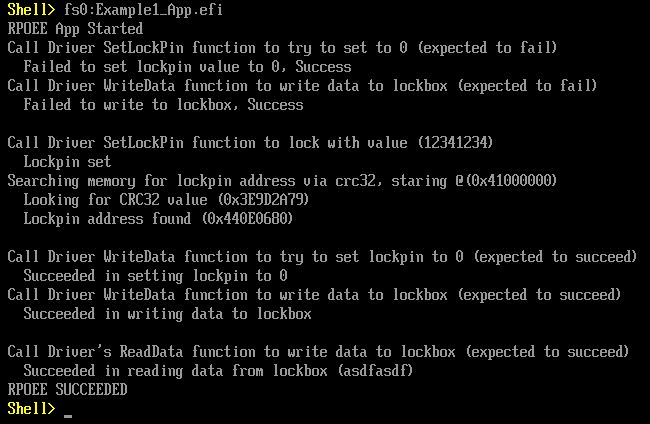
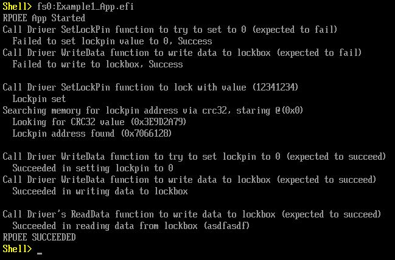

# Example 1

This is an example of a vulnerable dxe driver and associated reference proof of emergent execution (RPOEE).

The dxe driver provides a lockbox of 16kb, which is locked upon initialization with a lockpin. It has functions to read or write data from the lockbox via an offset and length. It has a function to set the lockpin. It provides minimal dxe driver functionality.

1. The driver has a `write anywhere primitive`, allow the lockpin prevents access to the lockbox. 
2. The SetLockPin function allows setting the lockpin value to anything other than 0, if it is not 0 (locked). 
3. If the value of an address were known the standard calculate CRC32 function could provide a leak of an address.

Therefore, using the SetLockPin function make the lockpin a known, unique value and the calculate CRC32 function will provide the address of the lockpin - by looping through memory to find the expected CRC32 value for the known value. Using the `write anywhere primitive` then allows setting the lockpin to 0, and thereby allowing writing to the lockbox. 

The app provides the RPOEE operations. It checks the lockbox/locking pin mechanisms are properly preventing access. It then attempts the functionality described above to gain access to the lockbox and write to, then read from it.

## Operation

### EmulatorPkg
The driver is defined in EmulatorPkg.dsc: `EmulatorPkg/Example1_Driver_Lockbox/Example1_Driver_Lockbox.inf`
The driver's protocol guid is defined in EmulatorPkg.dec: `  gExample1_Driver_LockboxProtocolGuid			 = { 0xf3aae06f, 0x7716, 0x4722,{ 0xb6, 0x26, 0x02, 0x64, 0x79, 0xb9, 0xfa, 0x57 } }`
The driver is automatically loaded via entry in EmulatorPkg.fdf: `INF  EmulatorPkg/Example1_Driver_Lockbox/Example1_Driver_Lockbox.inf`

#### Build

* Ensure `#define EMUPKG                  1 ` is uncommented in the `Example1_App.c` file

`EmulatorPkg/build.sh`

#### Run
`EmulatorPkg/build.sh run`

```
Missing ELF symbol "gInXcode".
(gdb) r
...
0x0000000043eb7602 in DebugAssert (FileName=FileName@entry=0x43ec325b "/home/derwin/Desktop/code_repo/edk2/MdeModulePkg/Universal/DriverSampleDxe/DriverSample.c", LineNumber=LineNumber@entry=1865, Description=Description@entry=0x43ec2c20 "!(((INTN)(RETURN_STATUS)(Status)) < 0)") at /home/derwin/Desktop/code_repo/edk2/MdeModulePkg/Library/PeiDxeDebugLibReportStatusCode/DebugLib.c:486
486	}
(gdb) c
...
```

In UEFI Shell:

```
Shell> fs0:Example1_App.efi
...

```

Should complete with: `RPOEE SUCCEEDED`



### OvmfPkg
The driver is defined in OvmfPkgX64.dsc: `EmulatorPkg/Example1_Driver_Lockbox/Example1_Driver_Lockbox.inf`
The driver is automatically loaded via entry in OvmfPkgX64.fdf: `INF  EmulatorPkg/Example1_Driver_Lockbox/Example1_Driver_Lockbox.inf`
* The source file can remain in the EmulatorPkg directory

#### Build

* Ensure `#define EMUPKG                  1 ` is commented in the `Example1_App.c` file
  
`OvmfPkg/build.sh`

#### Setup Files

Setup run-ovmf @ folder above edk2 `cd ../`

```
$ mkdir run-ovmf
$ cd run-ovmf
$ cp ../edk2/Build/OvmfX64/DEBUG_GCC5/FV/OVMF* .
$ cp ../edk2/Build/OvmfX64/DEBUG_GCC5/X64/*.efi hda-contents/
$ cp ../edk2/Build/OvmfX64/DEBUG_GCC5/X64/Example1* hda-contents/
$ cp OVMF.fd bios.bin
```

#### Run
from run-ovmf folder:

`qemu-system-x86_64  -pflash bios.bin -hda fat:rw:hda-contents -net none -debugcon file:debug.log -global isa-debugcon.iobase=0x402 -s -S`

In a second tab:

```
$ gdb
...

(gdb) target remote :1234
...

(gdb) c
```

In UEFI Shell:

```
Shell> fs0:Example1_App.efi
...
```

Should complete with: `RPOEE SUCCEEDED`



* ctrl+alt+g to get free from the window 


## Digression

### Driver
The driver creates a memory lockbox of size 16kb with a lockpin mechanism to prevent unauthorized write access to the lockbox. The lockbox is locked during driver initialization; preventing writes and allowing reads. The lockpin mechanism is such that if it is 0, then any value can be written to it. If it is not 0, then only non 0 values can be written to it.

The driver provides the following function:
1. `Example1_Driver_Lockbox_ReadData` (... `**dest`, `offset`, `length` )
    * `dest` is a void ** for return of data from lockbox, caller should allocate their own memory
    * `offset` is an int for an address offset from start of lockbox memory
    * `length` is an int for the amount of memory to return
    * the offset and length are validated to be within the lockbox
2. `Example1_Driver_Lockbox_WriteData_Wrapper` (... `offset`, `*src`, `length` )
    * `offset` is an int for an address offset from start of lockbox memory
    * `src` is a void * for data to be copied into lockbox memory
    * `length` is an int for the amount of memory to return
    * calls `Example1_Driver_Lockbox_WriteData` which validates
      * if lockpin is set
      * if destination address is within lockbox range
      * the mistake is that if lockpin is set and address is outside of the range, then a write will occur
3. `Example1_Driver_Lockbox_SetLockPin`(... `value` )
    * `value` is an int to write to the lockpin
    * if `value` is 0, then any int can be written to it
    * if `value` is not 0, then only not 0 int can be written

* The minimal DXE Driver functionality is provided too.

### App
The app makes use of the Driver's functionality to gain write access to the lockbox and validates that it is capable of writing to it.

We assume:
 *   EMUPKG ONLY: the address range to search for lockpin address starts at 0x41000000
 *   if we find the CRC value it may not be the proper place, if it fails to allow to write to the lockbox try searching past that point in memory

1. Get protocol for driver
2. Proves the lockpin cannot be set to 0
3. Proves the lockbox is write protected
4. Writes `12341234` to lockpin
5. Attempts to find lockpin with CRC32 read primitive
6. Uses `Example1_Driver_Lockbox_WriteData` as write primitive to overwrite lockpin with 0
7. Attempts to write value `asdfasdf`to lockbox
   1. This may fail
   2. return to crc search with a new starting location past previously found address
8. Attempts to read value `asdfasdf` back from the lockbox


